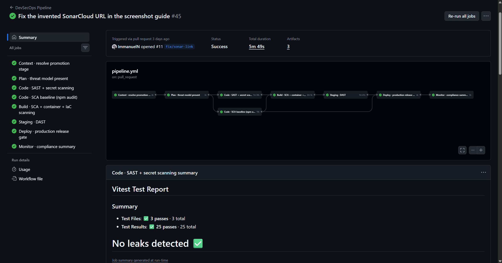

# Demonstration evidence — pipeline operates end to end

**Purpose (Section 6.2):** establish that the six-stage DevSecOps model executes
from Plan through Monitor. This is a claim about the *mechanism*, deliberately
separated from any claim about vulnerability detection, which is evidenced
separately by the seeded-case runs.

## Run under evidence

| | |
|---|---|
| Repository | `ImmanuelN/artisanmarket` (client) |
| Run | [35995410564](https://github.com/ImmanuelN/artisanmarket/actions/runs/35995410564) |
| Commit | `c85b19354eda4160555f66bf0532a4d75517ee5e` |
| Event | `pull_request`, base `main` |
| Started | 2026-09-24T11:50:43Z |
| Completed | 2026-09-24T11:55:46Z |
| Duration | ~5 minutes |
| Conclusion | **success** |

The `pull_request` event with base `main` resolves `production=true`, so all six
stages execute without modifying `main`.

> **Screenshot pending — `screenshots/pipeline-six-stages-green.png`.**
> *GitHub Actions — the six-stage model running end to end.*
> Capture instructions are in `screenshots/README.md`. Once the file is
> committed, delete this block and uncomment the embed below it.

<!--  -->
<!-- *GitHub Actions — the six-stage model running end to end.* -->

## Stage results

| Stage (Chapter 4) | Job | Result |
|---|---|---|
| — | Context · resolve promotion stage | success |
| Plan (4.3.1) | Plan · threat model present | success |
| Code (4.3.2, 4.3.3) | Code · SAST + secret scanning | success |
| Code (4.3.4) | Code · SCA baseline (npm audit) | success |
| Build (4.3.4–4.3.6) | Build · SCA + container + IaC scanning | success |
| Staging (4.3.7) | Staging · DAST | success |
| Deploy (4.3.8) | Deploy · production release gate | success |
| Monitor (4.3.9) | Monitor · compliance summary | success |

## DAST result

OWASP ZAP baseline against the built SPA served by `vite preview`:

```
FAIL-NEW: 0   FAIL-INPROG: 0   WARN-NEW: 0   WARN-INPROG: 0
INFO: 0       IGNORE: 10       PASS: 57
```

57 application-layer rules passed across 9 URLs. The 10 `IGNORE` entries are
response-header rules scoped out per-rule in `.zap/rules.tsv`: the DAST target is
a static file server, and header policy is applied at the CDN/static host
(threat T5). Those controls are recorded as requiring verification against the
deployed host, which this job does not cover.

## Validity caveats

These must be stated wherever this run is cited:

1. **Two gates were relaxed for this run.** `npm audit` and the Trivy filesystem
   scan are marked `continue-on-error`, tagged `DEMO-GATE-RELAXED` in the
   workflow. 27 pre-existing critical/high advisories remain, one requiring a
   semver-major `vite` upgrade. Without this the chain could not reach Build, so
   the run evidences stage execution, **not** a vulnerability-free dependency
   tree.
2. **Threat T1 is an accepted risk, not a remediation.** Three `localStorage`
   token writes carry documented exceptions. See `docs/threat-model.md`.
3. **The type check is advisory.** `tsc --noEmit` runs with
   `continue-on-error`; ~95 pre-existing errors would otherwise mask the
   security gate.

## Newly-active Build-stage coverage (2026-09-30)

The Build stage previously guarded its container and IaC steps on file
detection, and both self-skipped because no `Dockerfile` or `k8s/` existed. Both
artifacts now exist and both scanners execute against them.

| Scanner | First run | After remediation |
|---|---|---|
| Trivy (image) | 40 findings, 2 CRITICAL | **clean** at CRITICAL/HIGH |
| Checkov (`k8s/`) | 87 passed, 3 failed | **89 passed, 0 failed, 1 skipped** |

### What the image findings were, and why they were fixable

All 40 were OS packages in the base: `nginx:1.27-alpine` pins **alpine 3.21.3**.
Pinning forward to `nginx:1.31.6-alpine` (alpine 3.24.2) cleared 39 of them, and
the last — `libexpat` 2.8.4-r0, CVE-2026-93990 XML injection — was patched to
2.8.5-r0 in the image.

Pinned to a patch version rather than a floating `alpine` tag, so the image that
gets scanned is the image that gets deployed.

### Checkov: two fixed, one accepted

| Check | Outcome |
|---|---|
| `CKV_K8S_40` — high UID | Fixed. Runs as uid 10001; the base image's `nginx` user is 101 |
| `CKV2_K8S_6` — NetworkPolicy | Fixed. Default-deny plus explicit allows: ingress from the ingress controller only, egress limited to DNS — the browser calls the API directly, not this pod |
| `CKV_K8S_43` — image digest | Accepted. The digest does not exist until the Build stage produces the image; a committed placeholder would deploy something other than what was scanned |
(`CKV_K8S_35` does not apply — this workload takes no Secret at all.)

The exception is recorded in-band as `checkov.io/skip` annotations with
reasons, matching how the ESLint and ZAP exceptions in this project are handled.

### A recurrence of the step-suppression defect

The first run exposed the same defect previously fixed in the Code stage, now in
the Build stage: the image scan failing **ended its job**, so the Trivy
filesystem scan and both Checkov steps reported `skipped`. A base-image CVE was
therefore suppressing both dependency scanning and all IaC scanning — meaning
Checkov appeared wired but had never executed. All four Build scanners now carry
`!cancelled()`, so the stage fails on the union of findings rather than the
first one.

This is the eighth instance of the same underlying issue and the second
independent one, which is worth stating as a finding in its own right: in
GitHub Actions, step-level failure semantics silently narrow scanner coverage,
and each stage must be checked for it separately.

## Defects found by reaching each stage

Five pipeline defects were only discoverable once each stage unblocked the next.
They are recorded because they bear on the Section 6.2 argument: a pipeline that
stays red for unrelated reasons cannot evidence that its later stages are even
correctly configured.

| # | Defect | Stage exposed |
|---|---|---|
| 1 | `aquasecurity/trivy-action@0.24.0` does not exist; release tags carry a `v` prefix. Job failed at *Set up job* before any scanner ran | Build |
| 2 | Gitleaks fired on `docs/threat-model.md` — documenting a remediated fallback reproduced a literal matching the Stripe key rule | Code |
| 3 | API exits in `utils/encryption.js` unless `BANK_ENCRYPTION_KEY` is 64 hex chars, so it never bound its port and the health check timed out with no visible cause | Staging |
| 4 | `zaproxy/action-baseline@v0.12.0` uploads via the retired `upload-artifact` v3 backend — the scan passed but the step failed | Staging |
| 5 | Gitleaks scans the **whole PR commit range**, not just the head commit, so a secret introduced and removed within the same PR still fires | Code (PR only) |

Defect 5 generalises: remediating a committed secret in a later commit does not
satisfy secret scanning. The secret must never be committed, or history rewritten.
