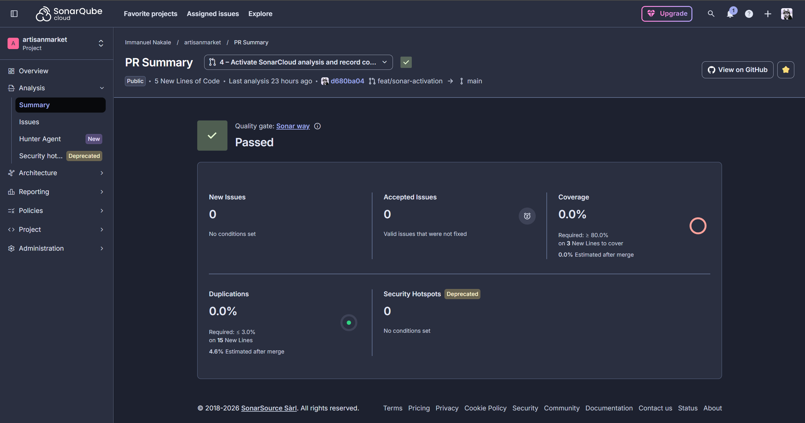

# Quality gate configuration

**Decision date:** 2026-10-01 · **Status:** passing on the default gate

The Code stage treats SonarQube as a **gate**, not a reporting step:
`sonar.qualitygate.wait=true` makes the scanner wait for the server-side result
and fail the build when it is `ERROR`. Without it the step uploads findings and
passes regardless.

## Result

The project passes SonarCloud's **unmodified default gate**, *Sonar way* — every
condition green, nothing relaxed, no paid feature used.

*SonarCloud quality gate, `artisanmarket` PR #4 — Passed on the default Sonar
way gate. Note the Coverage panel reading 0.0% against a required 80.0%: see
"Coverage on this repository" below for why that did not fail the gate.*

## The gate is SonarCloud's default, "Sonar way"

| Condition | Threshold |
|---|---|
| `new_security_rating` | worse than A fails |
| `new_reliability_rating` | worse than A fails |
| `new_maintainability_rating` | worse than A fails |
| `new_coverage` | below 80% fails |
| `new_duplicated_lines_density` | above 3% fails |
| `new_security_hotspots_reviewed` | below 100% fails |

### Why not a custom gate

A custom gate without the coverage condition was considered and **rejected on
cost**. SonarCloud restricts assigning any gate other than the default to paid
plans, and this project is bound by the open-source and free-tooling constraint
in Section 7.2 of the proposal.

Worth recording as a finding about tool selection: a free-tier hosted scanner
can constrain engineering decisions in ways the feature list does not make
obvious, and the constraint only surfaced at the point of trying to act on it.

## Coverage on this repository

The repository now has a test suite. Previously it had none, and
`new_coverage` reported 0% while the gate still passed.

The measured state of PR #4, from SonarCloud's own API:

| Metric | Value |
|---|---|
| `new_lines` | 15 |
| `new_lines_to_cover` | 3 |
| `new_uncovered_lines` | 3 |
| `new_coverage` | 0.0% |
| Gate condition `new_coverage LT 80` | reported **OK** |

So the condition did not fail despite 0% falling short of the 80% threshold,
and it was not a case of there being nothing to cover — there were three new
lines to cover and none of them were covered. SonarCloud does not document the
rule it applied here, and this project has not established it, so the mechanism
is left as an observation rather than explained.

What matters for the argument does not depend on the mechanism: a change with
0% coverage on new code passed a gate whose stated coverage condition is 80%.
The condition was not enforcing anything at that point, which is precisely why
the suite below was built rather than relied upon to appear.

**25 tests across 3 files**, covering `src/utils/validation.ts`,
`src/utils/orderReference.ts` and the `OrderConfirmation` page.

They assert security properties rather than counting lines. The central ones
cover the ReDoS fix (`typescript:S5852`): a 50,000-character hostile input and a
100,000-character input with no `@` must both return in under a second. Against
the previous pattern — `([.-]?\w+)*`, which nests quantifiers — those inputs
backtrack exponentially, and because validation runs on the UI thread a pasted
value could hang the tab. The suite also checks the pattern still accepts
ordinary addresses and still rejects malformed ones, so the fix cannot regress
into something merely permissive.

One test covers a client-side mass-assignment case: a role outside
`customer`/`vendor` is rejected. The server is authoritative, but the client
should not offer to submit a privileged role in the first place.

### Tooling constraint, since resolved

Vitest was initially pinned to **0.34.x** because the project was on Vite 4 and
current Vitest requires Vite 6 or newer — the same upstream constraint that had
already blocked upgrading Vite itself.

That is worth recording even though it no longer applies, because of what it
showed: a dependency too old to upgrade makes its *tooling* too old to upgrade.
The constraint compounded across a boundary rather than staying isolated, and
the test framework inherited a limitation that originated in the bundler.

Both were then resolved together. The project is on **Vite 7** with current
Vitest, and the dependency gate runs on the full tree rather than the
production-only scope it was narrowed to while Vite 4's dev-server advisories
were unfixable. See "Gate status" in `docs/threat-model.md`.

## Known false positives

None in this repository. The API repository has two marked `jssecurity:S5147`
findings; its `docs/evidence/quality-gate.md` records the reasoning, which is
worth reading as a general result about SAST taint analysis rather than a
repository-specific note.
